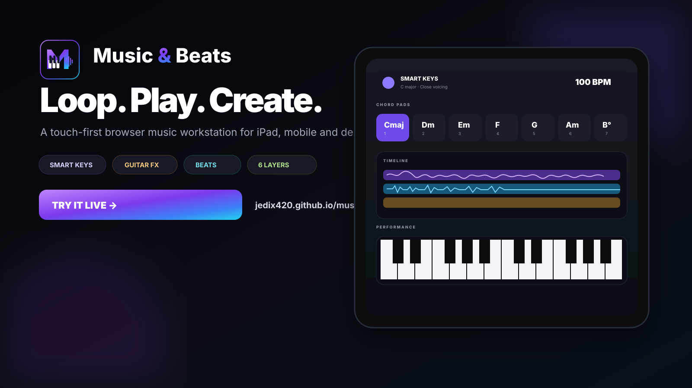
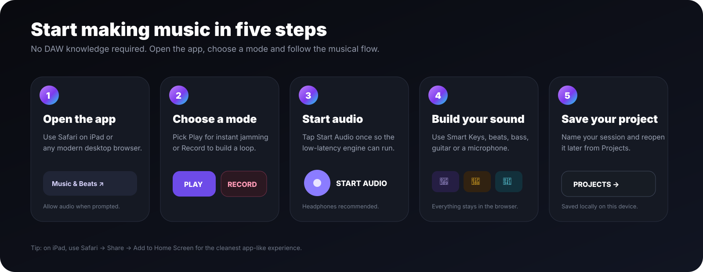
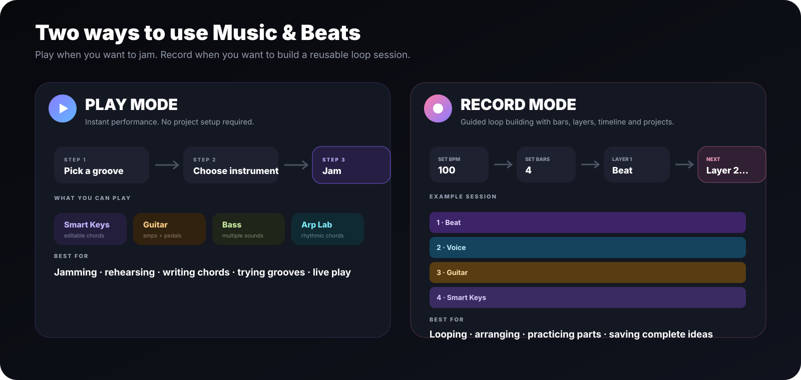

<div align="center">
  

  <h3>Loop. Play. Create.</h3>
  <p><strong>A touch-first browser music workstation built for iPad, mobile and desktop.</strong></p>
  <p>Jam with Smart Keys, guitar effects, bass and generated beats — or build a complete loop one layer at a time.</p>

  <p>
    <a href="https://jedix420.github.io/musicandbeats/"><strong>🎵 Launch Music & Beats</strong></a>
    &nbsp;•&nbsp;
    <a href="#-five-minute-quick-start">Quick start</a>
    &nbsp;•&nbsp;
    <a href="#-install-on-ipad">Install on iPad</a>
    &nbsp;•&nbsp;
    <a href="#-troubleshooting">Troubleshooting</a>
  </p>

  <p>
    
    
    
    
  </p>
</div>



## 🎧 What is Music & Beats?

**Music & Beats** is a lightweight music workstation that runs directly in your browser. It is designed for the moment when you have an idea and want to start making music immediately — without opening a large DAW, creating tracks manually or learning a complicated interface first.

You can use it in two ways:

- **Play mode** — instantly jam over a beat using Smart Keys, bass or a connected guitar.
- **Record mode** — choose BPM, bars and layer count, then build a loop one layer at a time and see it in a timeline.

The app is especially designed around **touch interaction on iPad**, but it also adapts to desktop and mobile layouts.

> **Live app:** https://jedix420.github.io/musicandbeats/

---

## ⚡ Five-minute quick start



If you have never used a looper or DAW before, start here:

1. Open the live app in Safari or another modern browser.
2. Choose **Play** if you simply want to jam, or **Record** if you want to build and save a loop.
3. Tap **Start audio** once. Browsers require a user gesture before low-latency audio can begin.
4. Pick an instrument or input and start playing.
5. In Record mode, use **Save** / **Projects** to keep the session on that device.

### Recommended first experiment

Try this simple session:

| Layer | Source | What to do |
|---|---|---|
| 1 | Beat | Pick **Worship** or **Pop**, set 100 BPM and generate a groove. |
| 2 | Smart Keys | Play `1 → 6 → 4 → 5` or tap the chord pads. |
| 3 | Bass | Play root notes underneath the chords. |
| 4 | Audio Input | Sing or hum a melody through the iPad microphone. |

That is enough to understand almost the entire workflow.

---

## 🎛️ Play mode vs Record mode



### ▶ Play mode — instant jamming

Use **Play** when you do not care about recording layers yet and just want to perform or explore an idea.

You get:

- BPM controls and metronome
- generated/editable drum patterns
- **Smart Keys** with seven editable chord pads
- full playable piano keyboard below the chord pads
- **Arp Lab** for rhythmic chord patterns
- connected **Guitar** with amp/pedal effects
- multiple **Bass** sounds
- velocity, sustain, tone and space controls

On touch devices the performance controls can be collapsed so more of the keyboard stays visible.

### ● Record mode — build a loop layer by layer

Use **Record** when you want to create a structured musical session.

Before recording you choose:

- **BPM** — the tempo of the session
- **Loop length** — 1, 2, 4, 8 or 16 bars
- **Layers** — start with 2–6
- **Count-in** — Off, 1, 2 or 4 bars

Each layer is then recorded individually against the same musical grid.

Available layer types:

`Audio Input` · `Guitar` · `Smart Keys` · `Bass` · `Beat`

The recording engine captures an exact musical loop length and restarts recorded layers on a common audio-clock phase so layers stay aligned.

---

# 🎹 Smart Keys

Smart Keys is the main harmonic instrument in Music & Beats.

By default, the key of C gives you seven ascending scale-degree pads:

`1 C` · `2 Dm` · `3 Em` · `4 F` · `5 G` · `6 Am` · `7 B°`

### Play chords

- Tap or hold any chord pad.
- On desktop, press number keys **1–7**.
- You can hold a number-key chord while simultaneously playing individual piano notes with the mouse/trackpad.
- On iPad, simply use the chord pads and keyboard together with touch.

### Edit every chord independently

Tap **Edit chords** and each of the seven pads becomes independently configurable.

You are not locked to the selected key. You could build something like:

`Cmaj9 · F#m7 · Bb · Dsus4 · G13 · Am9 · Ebmaj7`

Supported chord families include:

`Major` · `Minor` · `Diminished` · `Augmented` · `Sus2` · `Sus4` · `6` · `m6` · `7` · `Maj7` · `m7` · `Dim7` · `m7♭5` · `Add9` · `9` · `Maj9` · `m9` · `11` · `m11` · `13` · `m13`

Use **Reset from key** whenever you want to regenerate the normal seven chords for the selected key.

### Voicing

The **Voicing** control changes how the notes are spread:

- **Close** — compact normal chord
- **Open** — more space between chord tones
- **Wide** — broader, more cinematic voicing

### Performance controls

Smart Keys has four expression controls:

- **Velocity** — how hard/loud the instrument is triggered
- **Sustain** — how long notes ring after release
- **Tone** — darker ↔ brighter filtering
- **Space** — reverb amount

On iPad these controls default to a compact collapsed panel. Tap **Performance controls** to expand them.

---

## ✨ Arp Lab

Arp Lab turns a held Smart Key into a BPM-synchronised arpeggio.

Controls include:

- **Direction:** Up / Down / Up-Down / Random
- **Rate:** 1/4 / 1/8 / 1/16 / 1/8 triplet
- **Range:** 1 / 2 / 3 octaves
- **Gate:** controls note length
- **Latch:** keep the pattern running after releasing the pad

Chord changes use a legato handoff, so moving smoothly from pad `1 → 2 → 3` keeps the arpeggiator clock running rather than stopping and restarting the whole pattern.

---

# 🎸 Guitar

The Guitar instrument is for a **real connected guitar**. It does not generate fake guitar notes internally.

### What you need

Typical connection:

```text
Electric / electro-acoustic guitar
            │
            ▼
USB audio interface
            │ USB-C
            ▼
           iPad
```

Choose the interface/input exposed by Safari, connect it, and check the live signal meter before playing.

### Amp patches

Current starting rigs include:

- **Clean Glass**
- **Warm Combo**
- **Edge Crunch**
- **Arena Lead**
- **Ambient Swell**
- **Worship Shimmer**

### Pedals / effects

The guitar chain includes switchable Web Audio effects:

- **Drive** — saturation/distortion
- **Chorus** — width and movement
- **Delay** — repeating echoes
- **Space** — reverb/ambience

The processed guitar signal is what gets recorded into a Guitar layer.

### Monitoring

Use headphones when monitoring guitar through the app. Speaker monitoring can create feedback and adds acoustic delay.

> Browser-based guitar monitoring depends heavily on the iPad/interface combination. A proper low-latency USB audio interface will generally feel much better than Bluetooth audio.

---

# 🎤 Audio Input / vocals

Use **Audio Input** for vocals, acoustic instruments, microphones or other connected sources that should be recorded cleanly rather than through the Guitar amp chain.

### Input level controls

The input strip includes:

- live **dB meter**
- **Input Boost** from 0 to +18 dB
- **Auto Level**
- **Monitor**
- clipping warning

For the iPad built-in microphone, the default is approximately **+9 dB boost with Auto Level enabled**.

Auto Level adds gentle compression/makeup gain and performs safe post-record level normalisation so a quiet take does not play back dramatically softer than the rest of the session.

### Quick level guide

| Meter behaviour | What to do |
|---|---|
| Barely moves | Increase Input Boost. |
| “Good level” | Ideal — record. |
| “Strong signal” | Fine if it still sounds clean. |
| “Clipping” | Reduce Input Boost immediately. |

If you are using a properly gain-staged external audio interface and want untouched dynamics, switch **Auto Level off**.

---

# 🥁 Beats

The beat section combines presets, procedural variation and manual editing.

Available starting styles:

`Worship` · `Pop` · `Rock` · `Funk` · `House` · `Trap` · `Reggaeton` · `Lo-Fi`

### Generate a beat

1. Pick a style.
2. Choose an **Energy** level.
3. Tap **Generate variation**.
4. Start the beat.

### Edit the beat manually

The 16-step sequencer exposes:

- Kick
- Snare
- Hi-hat

Tap any step to toggle it on/off. You can also use **Clear** to start from an empty grid and program the entire groove yourself.

The sequencer follows the current BPM.

---

# 🎸 Bass

Bass is a playable low-register instrument with several different characters:

- **Sub Bass**
- **Finger Bass**
- **Pick Bass**
- **Upright Bass**
- **Analog Pulse Bass**
- **FM Round Bass**

Bass also uses the Velocity / Sustain / Tone / Space performance controls.

---

# ⏺️ Recording a session

## 1. Set up the grid

Open **Record**, then choose BPM, loop length, number of layers and count-in.

Example:

```text
BPM:      96
Bars:     4
Layers:   4
Count-in: 1 bar
```

## 2. Choose Layer 1

Pick what the first layer should contain.

A common starting point is **Beat**.

## 3. Press Record Layer

The app counts you in and then records for exactly the selected number of bars. You do not need to manually hit Stop on the exact last beat.

## 4. Move to the next layer

Previously recorded layers become your backing while you record the next part.

Example:

```text
Layer 1  Beat
Layer 2  Bass
Layer 3  Smart Keys
Layer 4  Vocal
```

## 5. Play the whole session

Tap **Play session** to hear every recorded layer restart together from the same loop boundary.

---

# 🎚️ Layer mixer controls

Every Record layer can be expanded from the layer rail.

Expanded controls include:

- **Volume**
- **Mute / Unmute**
- **Solo / Unsolo**
- **Open** — jump into that layer for editing/re-recording
- **Clear** — remove its recording

Collapse the layer again when you are finished to keep the session view clean.

---

# 🧭 Timeline

Tap **Timeline** in Record mode to open the tracks view.

The timeline displays the session horizontally by bar, with every layer stacked vertically. Recorded audio layers include waveform previews.

The timeline is useful for answering simple questions at a glance:

- Which layers have already been recorded?
- What source is on each layer?
- Which track am I editing?
- How long is the loop?
- Where is playback inside the current cycle?

Click/tap a timeline track to jump back to its layer.

---

# 💾 Projects

Music & Beats includes a local Projects library.

### Saving

Tap **Save**. On the first save, give the project a name.

A project keeps things such as:

- recorded layer audio
- BPM and bars
- layer configuration
- custom Smart Key chords
- instrument settings
- input-level settings
- guitar patch metadata

### Projects library

Open **Projects** to review your saved sessions.

You can:

- open a project
- rename it
- delete it
- save the current session as a new project/version

### Important: projects are local

Projects currently live in **IndexedDB on that browser/device**.

That means:

- a project saved on your iPad stays on that iPad/browser
- it does **not** automatically appear on your Mac
- clearing Safari website data can remove local projects

Cloud sync is not currently part of the core app.

---

# 📱 Install on iPad

For the best iPad experience, install it as a Home Screen web app.

1. Open **https://jedix420.github.io/musicandbeats/** in **Safari**.
2. Let the page load fully once while online.
3. Tap Safari's **Share** button.
4. Choose **Add to Home Screen**.
5. Confirm **Music & Beats**.
6. Launch it from the new icon.

The branded Music & Beats icon should appear on the Home Screen.

### iPad performance tips

- Prefer wired headphones or a USB audio interface for live monitoring.
- Avoid Bluetooth headphones for time-sensitive recording — Bluetooth adds noticeable latency.
- Keep the iPad reasonably charged; real-time audio processing is continuous work.
- If Safari shows text-selection handles while performing, reload to ensure the latest app version is active.
- Collapse **Performance controls** when you want maximum space for Smart Keys and the keyboard.

---

# 🖥️ Desktop controls

Desktop gets a few extra conveniences:

- Smart Key pads are mapped to **number keys 1–7**.
- You can hold a number-key chord while playing individual keyboard notes with the mouse/trackpad.
- Wider screens show more of the workstation simultaneously.

The core audio/session behaviour is shared with iPad.

---

# 🔊 Sound and audio architecture

Music & Beats is mostly local and browser-side.

```text
                    ┌──────────── Smart Keys / Bass synth
                    │
Touch / keyboard ───┼──────────── Beat sequencer
                    │
                    ├──────────── Guitar input → amp / pedals
                    │
                    └──────────── Audio input → preamp / Auto Level
                                      │
                                      ▼
                                Web Audio graph
                                      │
                           phase-locked loop capture
                                      │
                         layer mixer / timeline playback
                                      │
                                      ▼
                                  Master output

Projects ─────────────────────────── IndexedDB
PWA shell ───────────────────────── Service Worker
Hosting ─────────────────────────── GitHub Pages
```

The core application does not require a backend server. Music generation, audio processing and local project storage happen on the device.

---

# 🛠️ Troubleshooting

## I hear no sound

1. Tap **Start audio**.
2. Make sure the iPad/browser is not muted.
3. Check the device output route.
4. Reload the page if the browser suspended the audio context.

## The microphone records too quietly

Open the Audio Input layer and watch the level meter.

- Raise **Input Boost** from +9 dB toward +12 or +15 dB.
- Keep **Auto Level** enabled for the built-in iPad microphone.
- If the meter says **Clipping**, lower the boost.

## I hear feedback while monitoring the microphone

Turn **Monitor off** or use headphones. The microphone is hearing the iPad speakers and feeding the sound back into itself.

## My guitar feels delayed

- Avoid Bluetooth audio.
- Use a wired/USB audio interface.
- Close unnecessary heavy browser tabs/apps.
- Keep the guitar effects chain reasonable.

Some hardware/browser combinations have inherently higher round-trip latency than native Core Audio apps.

## The app looks like an older version after an update

Music & Beats is a PWA and uses a service worker.

Try:

1. close the existing tab/Home Screen app
2. reopen the live URL
3. refresh once

If a very old copy remains, clear the site's stored website data and reopen it.

## I accidentally get iPad text selection instead of playing

The latest builds disable Safari text selection/callouts on musical controls. If blue selection handles still appear, fully reload the latest version.

## My projects disappeared

Projects are local browser storage. They can disappear if Safari website data was cleared or the browser storage was reset.

---

# 🌐 Browser / hardware notes

Music & Beats uses browser media-device APIs and Web Audio.

The exact audio devices, channels and routing choices available are ultimately controlled by:

- Safari / browser support
- iPadOS / operating system routing
- the connected USB interface

A class-compliant USB audio interface that appears as a browser audio input is the best option for guitar and external microphones.

Deep multi-channel routing and native-DAW-level Core Audio control may eventually require a native iOS layer.

---

# 👨‍💻 Development

The app is intentionally dependency-light and is deployed as static files.

```bash
git clone https://github.com/JEDIx420/musicandbeats.git
cd musicandbeats
python3 -m http.server 8080
```

Then open:

```text
http://localhost:8080
```

For microphone permissions and normal PWA behaviour, use a secure HTTPS deployment. GitHub Pages provides HTTPS for the live app.

### Important files

```text
index.html                 App shell
styles.css                 Base responsive UI
app.js                     Core synth, beats, session and input foundations
workflow-fixes.js          Quantized recording / device refinements
v4-fixes.js                Sample-accurate AudioWorklet capture
v5-fixes.js                Layer mixer / shortcuts / responsive improvements
v6.js                      Guitar, Smart Keys, Arp Lab and timeline
v7.js                      Projects library + chord/arp refinements
v8.js                      Record header and session settings
v9.js                      iPad touch hardening / collapsible controls
v10.js                     Input preamp, metering and Auto Level
recorder-worklet.js        AudioWorklet loop recorder
manifest.webmanifest       PWA metadata
icon.svg                   Canonical Music & Beats app icon
assets/readme/             README branding and visual guides
```

---

# 🗺️ Roadmap ideas

High-value future additions include:

- WAV master mix export
- individual stem export
- overdub + undo history
- MIDI keyboard / foot-controller support
- pitch-preserving time stretching when BPM changes
- sampled acoustic/electric instrument sound packs
- deeper drum kits and per-step velocity
- cloud project sync / backup
- native iOS audio layer if browser routing becomes the limiting factor

---

## 🔒 Privacy / data model

The core app is local-first. Recorded project data is kept in the browser's local storage/database unless a future cloud feature is explicitly added.

There is currently no server-side account system required to make music.

---

<div align="center">
  

  <h3>Music & Beats</h3>
  <p><strong>Loop. Play. Create.</strong></p>
  <p><a href="https://jedix420.github.io/musicandbeats/"><strong>Launch the live workstation →</strong></a></p>
</div>
