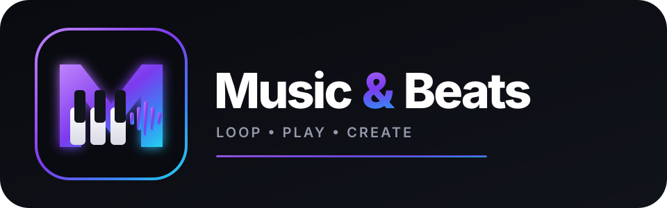
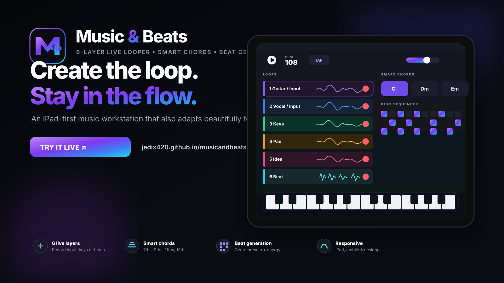
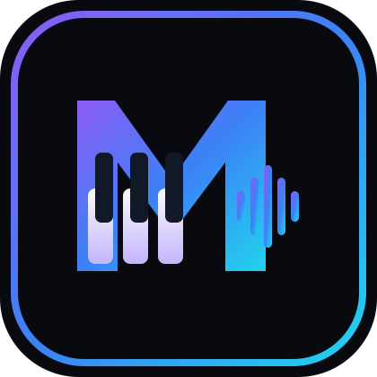

<div align="center">
  

  <p><strong>A responsive live-looping music workstation for iPad, mobile and desktop.</strong></p>
  <p>Layer audio, play expressive keys, trigger smart chords, generate beats and save ideas without leaving the browser.</p>

  <p>
    <a href="https://jedix420.github.io/musicandbeats/"><strong>🎹 Try Music & Beats Live</strong></a>
    &nbsp;•&nbsp;
    <a href="#install-on-ipad">Install on iPad</a>
    &nbsp;•&nbsp;
    <a href="#development">Run locally</a>
  </p>

  <p>
    
    
    
    
  </p>
</div>



## Make music without breaking the flow

**Music & Beats** is an iPad-first live looper and browser-based music workstation designed for fast musical ideas. Plug in an audio source, build up to six layers, add keys or chords, generate a groove, and save the session locally for later.

The interface is intentionally performance-oriented: large touch targets, multi-touch keyboard interaction, responsive layouts and a compact transport that stays usable across iPad, phones and desktop screens.

> **Live app:** https://jedix420.github.io/musicandbeats/

## What you can do

| | Feature | What it gives you |
|---|---|---|
| 🎛️ | **6-layer live looper** | Record up to six independent loop layers from connected audio input, the built-in keyboard or the beat machine. |
| 🎹 | **Playable multi-touch keys** | A responsive touch keyboard with independent finger tracking, held notes, glissando-style movement and multiple synth/keys presets. |
| 🎼 | **Smart Chords** | Play chords from one touch, choose the song key and move through triads, 6ths, 7ths, Maj7, m7, 9ths, Maj9, m9, 11ths, 13ths, sus2 and sus4. |
| 🎚️ | **Chord voicings** | Switch between close, open and wider chord voicings to make one-touch chords feel less robotic. |
| 🥁 | **Beat generator** | Start from Worship, Pop, Rock, Funk, House, Trap, Reggaeton or Lo-Fi patterns and generate editable variations with an energy control. |
| ◼️ | **16-step sequencer** | Edit kick, snare and hi-hat patterns directly and sync them to the session BPM. |
| ⏱️ | **Performance transport** | BPM, swing, metronome, play/stop and fast performance controls designed to stay accessible while playing. |
| 🎤 | **Connected audio input** | Use the iPad microphone or compatible USB/audio interfaces exposed by the browser and iPadOS. |
| 💾 | **Local project saving** | Sessions are stored in IndexedDB on the device, including loop recordings and project settings. |
| 📲 | **Installable PWA** | Add the app to the iPad Home Screen and use the cached app shell offline after it has been loaded. |

## Built for touch — not shrunk from desktop

The workstation changes its layout according to the space available instead of squeezing a desktop UI onto a smaller screen.

- **iPad / tablet:** large performance surface with the looper, keyboard and beat tools arranged for touch.
- **Mobile:** compact navigation and a playable keyboard layout that avoids microscopic keys.
- **Desktop:** wider workstation layout that keeps more tools visible at once.

The keyboard audio path is intentionally separated from microphone/device setup so playing notes does not trigger expensive audio-device discovery while you perform.

## Sound palette

The current lightweight Web Audio engine includes a growing collection of synthesized presets:

`Studio Grand` · `Soft Grand` · `Velvet EP` · `Wurli Drive` · `Tonewheel Organ` · `Warm Analog` · `Dream Pad` · `Air Choir` · `Glass Bell` · `Pluck` · `Sub Bass` · `Neon Lead`

The audio graph also includes master dynamics processing and reverb while remaining fully client-side.

## Beat styles

Choose a starting groove and then generate or manually edit variations:

`Worship` · `Pop` · `Rock` · `Funk` · `House` · `Trap` · `Reggaeton` · `Lo-Fi`

Adjust **BPM**, **swing** and **energy**, then tap individual steps to shape the pattern yourself.

## Install on iPad

1. Open **https://jedix420.github.io/musicandbeats/** in Safari.
2. Tap **Enable Audio** and allow microphone/audio access if you want to record an external source.
3. Tap Safari's **Share** button.
4. Choose **Add to Home Screen**.
5. Launch **Music & Beats** from the new Home Screen icon for a more app-like experience.

For the best live-audio experience, headphones or an audio interface are recommended when monitoring input to avoid feedback.

## Audio input notes

Music & Beats uses browser media-device APIs for connected audio input. The exact devices, channels and routing options available are ultimately controlled by Safari/iPadOS and the connected hardware.

Compatible USB audio interfaces that appear to the browser as an audio input can be selected inside the app after permission is granted. Professional multi-channel routing can require a future native Core Audio layer.

## Architecture

```text
Touch / Pointer UI
        │
        ├── Live Looper ─────── Connected audio input
        │
        ├── Smart Chords ──────┐
        ├── Keyboard / Synth ──┼── Web Audio graph ── Master output
        └── Beat Sequencer ────┘
                                │
                           IndexedDB
                        local project save

Service Worker → offline app shell / PWA
GitHub Pages  → static deployment
```

There is no backend required for the core workstation. Audio processing and project storage happen locally in the browser.

## Development

The app is intentionally dependency-light and can be served as static files.

```bash
git clone https://github.com/JEDIx420/musicandbeats.git
cd musicandbeats
python3 -m http.server 8080
```

Then open:

```text
http://localhost:8080
```

> Microphone access and service workers require an appropriate secure context in normal deployments. GitHub Pages supplies HTTPS for the live app.

## Main files

```text
index.html              App shell / workstation markup
styles.css              Responsive premium UI
app.js                   Audio engine, looper, keyboard, chords & beats
sw.js                    PWA caching / offline shell
manifest.webmanifest     Install metadata
assets/readme/           Project branding and README artwork
```

## Direction

Some of the next high-value additions for the project include:

- tighter bar-quantized recording and overdub/undo workflows
- waveform displays for recorded layers
- sampled piano, Rhodes, organ and instrument sound packs
- arpeggiator and chord-strum modes
- MIDI / foot-controller support
- WAV mix export and individual stem export
- deeper multi-channel audio-interface support through a native iOS audio layer if browser routing becomes limiting

---

<div align="center">
  
  <p><strong>Music & Beats</strong><br/>Loop. Play. Create.</p>
  <p><a href="https://jedix420.github.io/musicandbeats/">Launch the live app →</a></p>
</div>
