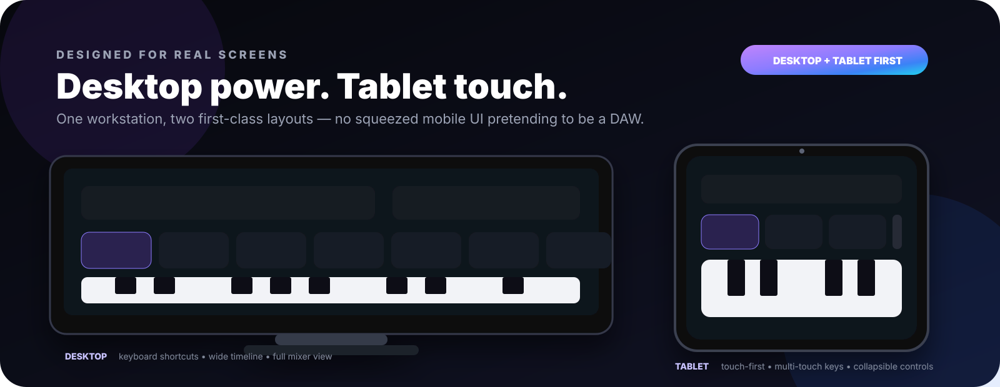
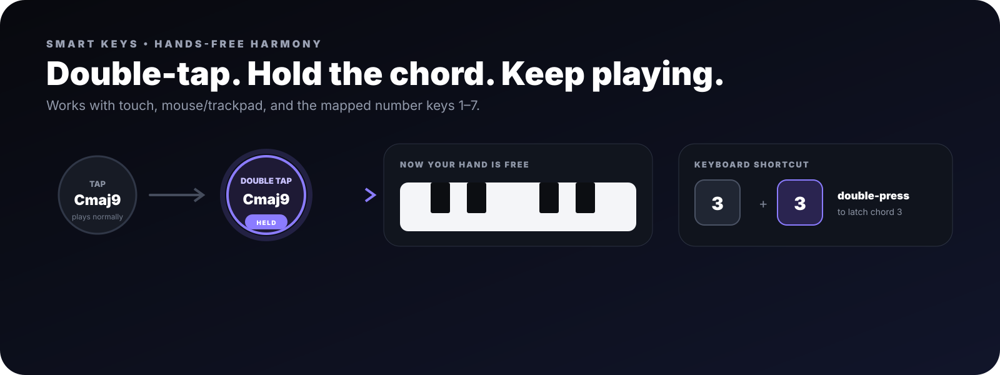

<div align="center">
  

  <h2>Loop. Play. Create.</h2>
  <p><strong>A browser music workstation designed first for desktop and tablet.</strong></p>
  <p>Touch-first on iPad. Keyboard-and-mouse friendly on desktop. Responsive on smaller screens.</p>

  <p>
    <a href="https://jedix420.github.io/musicandbeats/"><strong>🎵 Launch the live app</strong></a>
    &nbsp;•&nbsp;
    <a href="https://github.com/JEDIx420/musicandbeats"><strong>GitHub repo</strong></a>
    &nbsp;•&nbsp;
    <a href="#-five-minute-quick-start">Quick start</a>
    &nbsp;•&nbsp;
    <a href="#-troubleshooting">Troubleshooting</a>
  </p>

  <p>
    
    
    
    
  </p>
</div>




> **Live:** https://jedix420.github.io/musicandbeats/  
> **Source:** https://github.com/JEDIx420/musicandbeats

Music & Beats is an open-source, local-first music workstation for quickly turning an idea into a playable groove or a multi-layer loop. There is no account requirement and no backend required for the core workstation: synthesis, effects, loop capture and project storage happen in the browser.

If you like the project, ⭐ **star the repo**. If you want to change it, **fork it and make your own version**.

---

## ✨ The workstation at a glance


| Area | What it does |
|---|---|
| **Smart Keys** | Seven editable chord pads, number-key mapping, chord latch and Arp Lab. |
| **Piano keys** | Play individual notes underneath Smart Keys using touch or pointer input. |
| **Guitar** | Connect a real guitar/interface and use amp patches plus pedals. |
| **Bass** | Six playable bass sounds with expression controls. |
| **Beats** | Generate grooves or program the 16-step kick/snare/hat sequencer manually. |
| **Audio Input** | Record vocals/mics with input boost, meter, Auto Level and normalization. |
| **Record** | Build up to six phase-aligned loop layers one at a time. |
| **Timeline** | See recorded layers as track regions with waveform previews. |
| **Projects** | Name, save, reopen, rename and delete sessions locally. |

---

## ⚡ Five-minute quick start


If you have never used a looper or DAW before:

1. Open the **live app**.
2. Choose **Play** to jam immediately or **Record** to build a loop.
3. Press **Start audio** once. Browsers require a user gesture before audio can start.
4. Choose **Smart Keys**, **Guitar**, **Bass**, **Beat**, or **Audio Input**.
5. In Record mode, save the result from **Save / Projects**.

### A good first session

| Layer | Source | Try this |
|---|---|---|
| 1 | Beat | Worship or Pop, 100 BPM. |
| 2 | Smart Keys | Play `1 → 6 → 4 → 5`. |
| 3 | Bass | Add root notes underneath. |
| 4 | Audio Input | Hum or sing a melody. |

---

## 🎛️ Play mode vs Record mode


### ▶ Play mode

Use Play when you want to improvise immediately. You get the transport, beat machine, Smart Keys, individual piano notes, Arp Lab, Guitar rig and Bass without creating a recording session first.

### ● Record mode

Use Record when you want a structured loop. Choose:

- **BPM:** 40–220
- **Loop:** 1 / 2 / 4 / 8 / 16 bars
- **Layers:** 2–6 initially, with more controls in the layer rail
- **Count-in:** Off / 1 / 2 / 4 bars

Every recorded layer is captured against the same musical grid and played back from a shared Web Audio clock boundary.

---

# 🎹 Smart Keys

Smart Keys is the harmonic centre of Music & Beats.

In C, the default seven pads are ascending:

`1 C` · `2 Dm` · `3 Em` · `4 F` · `5 G` · `6 Am` · `7 B°`

## Play normally

- **Tablet/touch:** press and hold a chord pad.
- **Desktop:** click/hold a chord pad or press **1–7**.
- The piano keyboard below stays independently playable, so you can hold a chord and improvise notes over it.

## 🔒 Double-tap to hold a chord



You no longer need to keep one finger or keyboard key held down.

- **Double-tap** a Smart Key on a tablet to latch it.
- **Double-click** a Smart Key with a mouse/trackpad to latch it.
- **Double-press the matching number key** (`1–7`) to latch it from the keyboard.
- A held pad gets a glowing **HELD** indicator.
- Double-tap the same chord again to release it.
- Double-tap another chord to move the latch to that chord.
- **Stop Session**, leaving the instrument, or leaving the page also clears the held chord.

With **Arp Lab enabled**, the same gesture holds the active arpeggio target instead of a sustained chord.

This makes it easy to latch harmony and use both hands for individual notes, bass, guitar controls or other performance gestures.

## Edit every chord independently

Press **Edit chords**. Every slot can have its own root and chord family regardless of the selected key.

Example custom bank:

`Cmaj9 · F#m7 · Bb · Dsus4 · G13 · Am9 · Ebmaj7`

Supported families include:

`Major` · `Minor` · `Diminished` · `Augmented` · `Sus2` · `Sus4` · `6` · `m6` · `7` · `Maj7` · `m7` · `Dim7` · `m7♭5` · `Add9` · `9` · `Maj9` · `m9` · `11` · `m11` · `13` · `m13`

Use **Reset from key** to regenerate the normal seven diatonic chords.

## Voicing and expression

**Voicing:** Close / Open / Wide.

**Performance controls:**

- **Velocity** — playing intensity
- **Sustain** — release time
- **Tone** — darker ↔ brighter
- **Space** — reverb amount

On touch devices these controls default to a compact collapsible panel so more of the piano is visible.

---

## ✨ Arp Lab

Arp Lab converts a held Smart Key into a BPM-synchronised arpeggio.

- Direction: **Up / Down / Up-Down / Random**
- Rate: **1/4 / 1/8 / 1/16 / 1/8 triplet**
- Range: **1 / 2 / 3 octaves**
- Gate: note length
- Latch: keep the arp running

Chord changes use a legato handoff so moving `1 → 2 → 3` does not unnecessarily restart the rhythmic clock.

---

# 🎸 Guitar rig

Guitar is for a **real connected instrument** rather than a simulated guitar keyboard.

```text
Guitar → USB audio interface → desktop/tablet → Music & Beats
```

### Amp patches

- Clean Glass
- Warm Combo
- Edge Crunch
- Arena Lead
- Ambient Swell
- Worship Shimmer

### Pedals

- **Drive** — saturation/distortion
- **Chorus** — movement/width
- **Delay** — echoes
- **Space** — ambience/reverb

The processed guitar chain is what gets captured when you record a Guitar layer.

For monitoring, prefer wired headphones and a proper low-latency USB interface. Bluetooth audio is not recommended for timing-sensitive playing.

---

# 🎤 Audio Input / vocals

Use Audio Input for vocals, microphones, acoustic instruments or a clean external source.

The input strip provides:

- live **dB meter**
- **Input Boost** from 0 to +18 dB
- **Auto Level**
- **Monitor**
- clipping feedback
- safe post-capture normalization

The built-in mic starts around **+9 dB Input Boost + Auto Level ON** to avoid unnaturally quiet playback.

| Meter | Meaning |
|---|---|
| Barely moves | Raise Input Boost. |
| Good level | Ready to record. |
| Strong signal | Fine if clean. |
| Clipping | Lower Input Boost. |

---

# 🥁 Beats

Choose a style:

`Worship` · `Pop` · `Rock` · `Funk` · `House` · `Trap` · `Reggaeton` · `Lo-Fi`

Set **Energy**, press **Generate**, then edit the Kick / Snare / Hat steps manually if you want. The sequencer follows the current BPM.

---

# 🎸 Bass

Playable bass presets:

`Sub Bass` · `Finger Bass` · `Pick Bass` · `Upright Bass` · `Analog Pulse Bass` · `FM Round Bass`

Bass shares the Velocity / Sustain / Tone / Space expression controls. Explicit **Stop Session** performs a hard transport stop so long bass release tails cannot continue after the rest of the loop has stopped.

---

# ⏺️ Recording a session

### 1 — Set the grid

Example:

```text
BPM       96
Bars      4
Layers    4
Count-in  1 bar
```

### 2 — Choose a source

`Audio Input` · `Guitar` · `Smart Keys` · `Bass` · `Beat`

### 3 — Record Layer

The app counts in and captures exactly the selected musical duration. You do not have to hit Stop precisely on the final beat.

### 4 — Add the next part

Completed layers play as backing while you record the next layer.

### 5 — Play Session

All recorded layers restart together from the shared phase boundary. Pressing Stop Session now hard-stops layer playback and active live voices together.

---

# 🎚️ Layer mixer

Expand any layer card for:

- Volume
- Mute / Unmute
- Solo / Unsolo
- Open
- Clear

Collapse the card again when you want more workspace.

---

# 🧭 Tracks Timeline

The Timeline gives Record mode a DAW-style overview:

- bars across the top
- one row per layer
- recorded regions
- audio waveform previews
- current-track highlighting
- playback playhead

Tap/click a track region to jump back to that layer.

---

# 💾 Projects

Projects are stored locally in **IndexedDB** on the current browser/device.

You can:

- save a named project
- update the currently open project
- save a copy as a new project
- reopen projects
- rename projects
- delete projects

Saved data can include recorded audio, BPM/bars, layer setup, Smart Key definitions, instrument expression, Guitar settings and Audio Input settings.

> **Important:** projects do not currently sync between devices, and clearing site data can remove them.

---

# 📱 Tablet / iPad setup

For iPad, Safari is recommended.

1. Open https://jedix420.github.io/musicandbeats/
2. Load the app once while online.
3. Tap **Share**.
4. Choose **Add to Home Screen**.
5. Launch Music & Beats from the branded icon.

### Tablet performance tips

- Use wired headphones/interface for live monitoring.
- Avoid Bluetooth for timing-critical recording.
- Collapse Performance controls for a larger keyboard area.
- The workstation blocks Safari text-selection/copy callouts across performance surfaces, so chord and piano gestures behave like instrument controls rather than webpage text.

---

# 🖥️ Desktop workflow

Desktop is a first-class target, not an afterthought.

- Number keys **1–7** trigger Smart Keys.
- Double-press a number to **hold/latch** that chord.
- Mouse/trackpad can play individual piano notes while a chord is sounding.
- Wider layouts expose more tracks, mixer controls and timeline information at once.

---

# 🔊 Architecture

```text
Touch / mouse / keyboard
          │
          ├── Smart Keys + Arp ──┐
          ├── Bass synth ────────┤
          ├── Beat sequencer ────┼── Web Audio graph ── Master output
          ├── Guitar rig ────────┤
          └── Mic / clean input ─┘
                                  │
                         AudioWorklet capture
                                  │
                        phase-aligned layers
                                  │
                      mixer + tracks timeline

Projects ───────────────────── IndexedDB
PWA shell ─────────────────── Service Worker
Hosting ───────────────────── GitHub Pages
```

The core workstation is static HTML/CSS/JavaScript with Web Audio and no build step required.

---

# 🛠️ Troubleshooting

### No sound

1. Press **Start audio**.
2. Check the device output route and volume.
3. Reload if the browser suspended the AudioContext.

### Microphone is too quiet

Use the live meter, raise **Input Boost**, and keep **Auto Level** enabled for the built-in mic unless you specifically want raw dynamics.

### Guitar latency feels high

Use a wired USB audio interface and wired headphones. Avoid Bluetooth.

### A chord seems stuck

A glowing **HELD** badge means the chord is intentionally latched. Double-tap/double-click it again, double-press the matching number, switch to another latched chord, or press Stop Session.

### iPad shows Copy / Search / blue selection handles

Close/reopen the tab or installed PWA once to ensure the latest service worker is active. Current builds disable text selection and touch callouts across performance surfaces while preserving real editable inputs.

### The site looks like an older version

The app uses a service worker. Close the old tab/PWA, reopen it, then refresh once so the latest cache can activate.

### Saved project is missing on another device

Projects are currently local to the browser/device. There is no cloud sync yet.

---

# 👩‍💻 Run locally

```bash
git clone https://github.com/JEDIx420/musicandbeats.git
cd musicandbeats
python3 -m http.server 8080
```

Then open:

```text
http://localhost:8080
```

For microphone/PWA functionality outside localhost, serve over HTTPS.

---

# 🍴 Fork it, modify it, build on it

This project is intentionally easy to inspect and remix.

1. **Fork** the repository.
2. Clone your fork.
3. Change the sounds, layouts, chord logic, effects or workflow.
4. Host your fork on GitHub Pages or another static host.
5. If you build something interesting, share it.

If Music & Beats is useful to you, please **leave a ⭐ on GitHub** — it helps other musicians and developers discover it.

---

<div align="center">
  
  <h3>Music & Beats</h3>
  <p><strong>Designed for desktop + tablet. Built to stay in the flow.</strong></p>
  <p><a href="https://jedix420.github.io/musicandbeats/"><strong>Launch live →</strong></a> &nbsp;•&nbsp; <a href="https://github.com/JEDIx420/musicandbeats"><strong>Fork / Star on GitHub →</strong></a></p>
</div>
